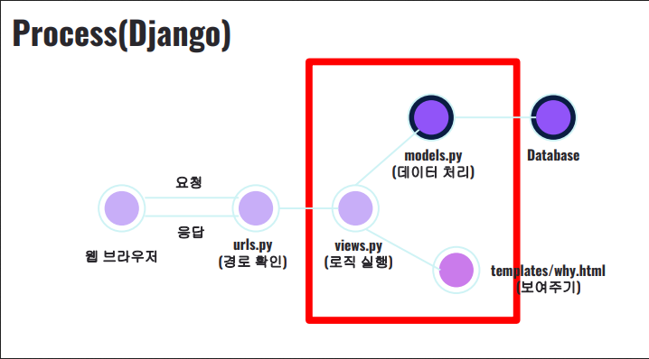

# MVT Pattern

- models.py views.py templates
  - 데이터(model), 데이터 처리 로직(view), 사용자 인터페이스(template)구분
  - 즉, 각 구분된 부분의 내용이 독립, 서로 간섭을 주지 않게 설계하는 것
- spring은 mvc pattern / view가 template, controller가 view

- django의 수많은 기능.. Sending mail, ORM, Form... django여야만 하는 이유?

  - 많은 기능을 가지고있는 풀스택 프레임워크이며, 강력한 ORM(Obejct-Relational Mapping)
  - settings.py에 middleware가 보안관련부분이 많은데, 쉬우면서도 강력한 부분이 많음

- DB처리가 필요한 경우 Model을 통해 처리하고 그 결과를 받는다
  HTML렌더링이 필요한 경우 응답할 HTML을 생성한다

## django-admin startapp

- app을 나누는 기준은 뭘까? - 기능, DB 등등.. 정답은 없다
- 가장 정답에 가까운 것은 erd의 테이블들이 어디에 다 들어갈 것이냐에 대한 분기점을 기준으로

## urls.py는 왜 안만들어지는가?

- url 제어 방법에는, 10가지정도? 그 이상이 있을 수 있는데 다양한 방법으로도 url제어를 할 수 있도록 기본값에서는 확장성을 열어둔 것.
  url을 include시켜나가는게 관행적인 것
- Django 사용자의 선택지를 넓히기 위해서 일부러 urls.py를 일부러 만들어 주지 않는다
- 독립적으로 앱을 쓰라는 장고의 철학과도 배척된다. 사실 그냥 루트폴더의 urls.py에 다 넣어버릴 수도 있는 것. 이런 사항들에 대해 "왜?"라는 의문을 품어야한다
- users 라는 app 이 있는경우 다른 앱에서도 users라는 app을 사용할 수 있도록 해줄 수 있다.
