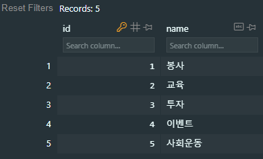

## 초기값

DB가 생성될 때 데이터들의 초기값을 주고싶었다.

가령 ["봉사", "교육", "투자", "이벤트", "사회운동"]을 캠페인의 카테고리로서 넣어주고 싶었는데..

https://docs.djangoproject.com/en/4.2/topics/migrations/#data-migrations

# Data Migrations

데이터베이스 스키마를 변경하는 것 외에도, 스키마와 함께 데이터베이스의 데이터를 변경하기 위해 마이그레이션을 사용할 수 있습니다.

데이터를 변경하는 마이그레이션은 일반적으로 "데이터 마이그레이션"이라고 부릅니다. 이러한 데이터 마이그레이션은 스키마 마이그레이션과 별도의 마이그레이션으로 작성하는 것이 가장 좋습니다.

Django는 스키마 마이그레이션과 마찬가지로 데이터 마이그레이션을 자동으로 생성할 수 없지만, 작성하는 것은 어렵지 않습니다. Django의 마이그레이션 파일은 작업(Operations)으로 구성되며, 데이터 마이그레이션에 가장 많이 사용되는 주요 작업은 RunPython입니다.

먼저, 작업할 빈 마이그레이션 파일을 생성합니다. 다음 명령어를 실행하면 Django가 파일을 올바른 위치에 생성하고 이름을 제안하며 종속성(dependencies)을 추가해줍니다:

```bash
python manage.py makemigrations --empty yourappname
```

```python
# Generated by Django A.B on YYYY-MM-DD HH:MM
from django.db import migrations

class Migration(migrations.Migration):
    dependencies = [
    ("yourappname", "0001_initial"),
    ]

    operations = []
```

이제 새로운 함수를 작성하고 RunPython에서 이 함수를 사용하면 됩니다. RunPython은 호출 가능한 함수를 인수로 받으며, 이 함수는 두 개의 인수를 사용해야 합니다. 첫 번째 인수는 앱 레지스트리(app registry)로, 이 레지스트리에는 마이그레이션의 위치와 일치하는 모든 모델의 이전 버전이 로드됩니다. 두 번째 인수는 SchemaEditor이며, 이를 사용하여 데이터베이스 스키마 변경을 수동으로 수행할 수 있지만, 이렇게 하면 마이그레이션 자동 탐지기를 혼동시킬 수 있으니 주의해야 합니다!

위에서 언급한 내용을 참고하여 데이터 마이그레이션을 생성하고 사용할 수 있습니다. 데이터베이스 스키마 변경과 함께 데이터를 수정할 수 있습니다.

이제 우리는 first_name과 last_name의 결합된 값을 새로운 name 필드에 채우는 마이그레이션을 작성해보겠습니다 (모두가 이름과 성을 가지고 있는 것이 아니라는 것을 깨달았습니다). 이를 위해서는 이전 버전의 모델을 사용하고 행을 반복하기만 하면 됩니다:

```python
from django.db import migrations


def combine_names(apps, schema_editor):
    # 이 마이그레이션이 예상보다 더 최신 버전일 수 있으므로,
    # 직접적으로 Person 모델을 가져올 수 없습니다.
    # 따라서 이전 버전의 모델을 사용합니다.
    Person = apps.get_model("yourappname", "Person")
    for person in Person.objects.all():
        person.name = f"{person.first_name} {person.last_name}"
        person.save()


class Migration(migrations.Migration):
    dependencies = [
        ("yourappname", "0001_initial"),
    ]

    operations = [
        migrations.RunPython(combine_names),
    ]
```

이 작업을 마치면 일반적으로 `python manage.py migrate` 명령어를 실행하면 데이터 마이그레이션이 다른 마이그레이션과 함께 실행됩니다.

RunPython에 두 번째 호출 가능한 함수를 전달하여 역방향 마이그레이션 시 실행할 로직을 정의할 수 있습니다. 이 호출 가능한 함수를 생략하면 역방향 마이그레이션 시 예외가 발생합니다.

## Apply

```python
from django.db import migrations


def make_categories(apps, schema_editor):
    CampaignCategory = apps.get_model("campaigns", "CampaignCategory")
    categories = ["봉사", "교육", "투자", "이벤트", "사회운동"]

    for category_name in categories:
        CampaignCategory.objects.create(name=category_name)


class Migration(migrations.Migration):
    dependencies = [
        ("campaigns", "0001_initial"),
    ]

    operations = [
        migrations.RunPython(make_categories),
    ]
```



`0001_initial`이 존재할 때 사용할 수 있는 0002 파일로서 만들어봤는데, 이러면 배포 빌드 시에 migrate를 두번 입력해야할 것 같다.
0001에 포함시켜서 작성해볼 계획.

```python
from django.conf import settings
from django.db import migrations, models
import django.db.models.deletion


def make_categories(apps, schema_editor):
    CampaignCategory = apps.get_model("campaigns", "CampaignCategory")
    categories = ["봉사", "교육", "투자", "이벤트", "환경운동"]

    for category_name in categories:
        CampaignCategory.objects.create(name=category_name)


class Migration(migrations.Migration):

    initial = True

    dependencies = [
        migrations.swappable_dependency(settings.AUTH_USER_MODEL),
    ]

    operations = [
        migrations.CreateModel(
            # ... 중략 ...
        )
        migrations.RunPython(make_categories),
    ]
```
