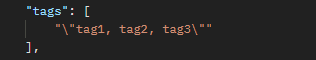
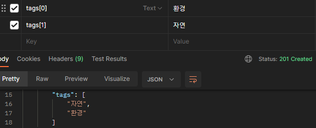

# DRF에서 Tag 구현해보기

[공식문서](https://django-taggit.readthedocs.io/en/latest/index.html)

## Install

```bash
pip install django-taggit
```

## settings.py

```python
INSTALLED_APPS = [
    ...
    'taggit',
]

TAGGIT_CASE_INSENSITIVE = True
TAGGIT_LIMIT = 50
```

## Models.py

```python
from taggit.managers import TaggableManager

class Campaign(models.Model):
    ...
    tags = TaggableManager(blank=True)
```

## Usage with DRF

```python
from taggit.serializers import (TagListSerializerField,
                                TaggitSerializer)


class CampaignCreateSerializer(TaggitSerializer, serializers.ModelSerializer):
        class Meta:
        model = Campaign
        fields = (
            ...
            "tags",
        )

    tags = TagListSerializerField()
```

## admin.py

ModelAdmin.`list_display`에 TaggableManager를 포함시킬 경우 다음과 같은 에러가 나온다.

```bash
AttributeError: '_TaggableManager' object has no attribute 'name'
```

`list_display`에 ManyToManyField를 포함시킬 수 없는 이유와 같다.

ModelAdmin.list_display에 태그를 표시하려면 쿼리를 최소화하기 위해 `prefetch_related()`를 사용하여 추가할 수 있다.

```python
class MyModelAdmin(admin.ModelAdmin):
    list_display = ['tag_list']

    def get_queryset(self, request):
        return super().get_queryset(request).prefetch_related('tags')

    def tag_list(self, obj):
        return u", ".join(o.name for o in obj.tags.all())
```

## Error

form-data로 요청을 보내니 tags에 아무리 요청을 보내도



위 사진과 같이 쉼표로 분리되질 않았다.

form-data에서 여러 값을 하나의 키로 보내기 위해서는 각 값을 따로따로 입력해줘야 했다. 태그들을 각각의 키로 입력시켜줬다.


