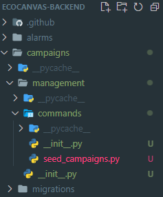

# Create Dummy Data

더미데이터 만들어보기

## [django-seed](https://github.com/Brobin/django-seed)

```python
pip install django-seed
```

```python
# settings.py
INSTALLED_APPS = (
    ...
    'django_seed',
)
```

이후 원하는 앱 안에 management/commands/ 폴더 구성

`__init__.py`를 만들어 폴더 인식할 수 있게 해준다.



`BaseCommand`를 사용하면 `python manage.py <file_name>`으로 실행이 가능해진다.

[공식문서](https://docs.djangoproject.com/en/4.2/howto/custom-management-commands/)에서 제시하는 코드는 이렇다.

```python
from django.core.management.base import BaseCommand, CommandError
from polls.models import Question as Poll


class Command(BaseCommand):
    help = "Closes the specified poll for voting"

    def add_arguments(self, parser):
        parser.add_argument("poll_ids", nargs="+", type=int)

    def handle(self, *args, **options):
        for poll_id in options["poll_ids"]:
            try:
                poll = Poll.objects.get(pk=poll_id)
            except Poll.DoesNotExist:
                raise CommandError('Poll "%s" does not exist' % poll_id)

            poll.opened = False
            poll.save()

            self.stdout.write(
                self.style.SUCCESS('Successfully closed poll "%s"' % poll_id)
            )
```

내가 직접 캠페인, 후기, 댓글 더미데이터 생성을 위해 작성해본 코드.

```python
import random
from faker import Faker
from django.core.management.base import BaseCommand
from campaigns.models import Campaign
from campaigns.models import CampaignReview
from campaigns.models import CampaignComment
from users.models import User
from django.utils import timezone
from datetime import timedelta


class Command(BaseCommand):
    help = "Create dummy campaign data with this command."

    def add_arguments(self, parser):
        parser.add_argument(
            "--total",
            default=10,
            type=int,
            help="How many campaigns are you creating"
        )

    def handle(self, *args, **options):
        total = options.get("total")
        users = User.objects.all()
        faker = Faker(["ko_KR"])

        for _ in range(total):
            user = random.choice(users)
            Campaign.objects.create(
                user=user,
                title=faker.unique.bs(),
                content=faker.text(),
                members=random.randint(1,100),
                campaign_start_date=timezone.now(),
                campaign_end_date=timezone.now() + timedelta(seconds=random.randint(0, 86400)),
                status=1,
                tags=faker.word(),
            )

        campaigns = Campaign.objects.all()
        for _ in range(total):
            user = random.choice(users)
            campaign = random.choice(campaigns)
            CampaignReview.objects.create(
                user=user,
                campaign=campaign,
                title=faker.word(),
                content=faker.text(),
            )

        for _ in range(total):
            user = random.choice(users)
            campaign = random.choice(campaigns)
            CampaignComment.objects.create(
                user=user,
                campaign=campaign,
                content=faker.text(),
            )
        self.stdout.write(self.style.SUCCESS(f"Created {total} Campaigns."))
        self.stdout.write(self.style.SUCCESS(f"Created {total} Campaign reviews."))
        self.stdout.write(self.style.SUCCESS(f"Created {total} Campaign comments."))
```

`python manage.py seed_campaigns`로 실행할 수 있고,  
뒤에 옵션으로 `--total=100`를 주면 갯수를 직접 지정할 수 있다.

(총 유저수 \* 1)개씩 만들어지니 조심해야한다.
