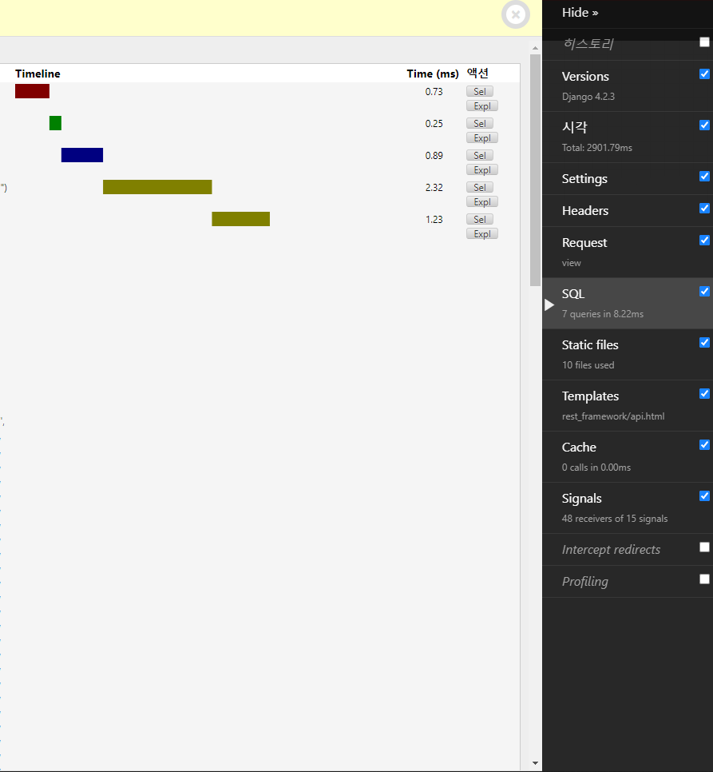

## 문제


캠페인 더미데이터를 1300개 가량 만들어서 속도테스트를 해봤다.


렌더링에 2500 ~ 3000ms가 걸리고있었다.



쿼리최적화쪽 문제도 아닌 것 같다.
처음엔 리액트쪽 프론트 코드 문제가 아닌가 싶어 리액트 디버깅도 시도도 해보았다.

하지만 백에서 신호 자체가 너무 늦게오고있는데다, 프린트문을 찍어보니 백엔드 코드 문제라는게 거의 확실했다.

그러던 중, 코드리뷰 때 궁금했던 페이지네이션이 먼저인가 직렬화가 먼저인가하는 의문이 다시한번 떠올랐다.

## Serializing vs Paginating

```python
    def get(self, request):
        ...
        serializer = CampaignSerializer(queryset, many=True)

        pagination_instance = self.pagination_class()
        total_count = queryset.count()
        pagination_instance.total_count = total_count
        paginated_data = pagination_instance.paginate_queryset(
            serializer.data, request)

        return pagination_instance.get_paginated_response(paginated_data)
```

2.5초 걸리던 문제의 코드

query 조건에 대해 필터링을 한 후, 모든 데이터에 대해 `CampaignSerializer`로 직렬화 한 후 페이지네이션 단위로 자르고있었다.

아마 1300개 가량의 데이터를 전부 직렬화 하는 시간이 2500 ~ 3000ms의 대부분이었나보다.

```python
        pagination_instance = self.pagination_class()
        paginated_data = pagination_instance.paginate_queryset(
            queryset, request)

        serializer = CampaignSerializer(paginated_data, many=True)

        return pagination_instance.get_paginated_response(serializer.data)
```

페이지네이션으로 먼저 데이터를 줄이고, 직렬화처리를 후에 하는방식으로 바꿔보았다.


렌더링 시간이 100ms로 줄어들었다.

## 결론

처음 이 문제가 떠올랐을땐 직렬화를 먼저하면 페이지네이션 할때 이미 다 직렬화 해놓았으니 페이지 바꿀때는 유리할까? 아니면 전혀 상관이없는걸까? 하는 의문들을 품었었다.

역시 페이지네이션 단위로 데이터를 자른 후 그 데이터들에 대해서만 직렬화하는게 올바른 방법이었다. get요청을 페이지가 바뀔 때마다 보내니 미리 직렬화해놓는 그런 개념이 아니었던 것 같다.
