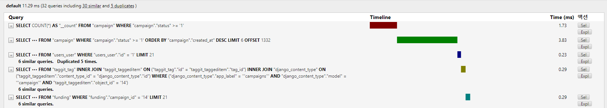
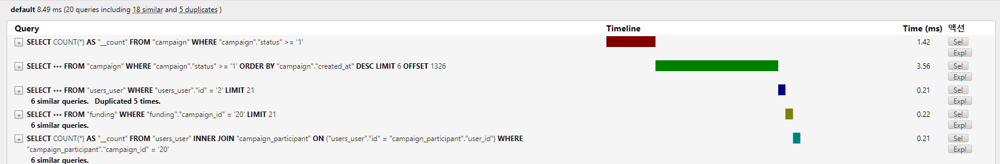
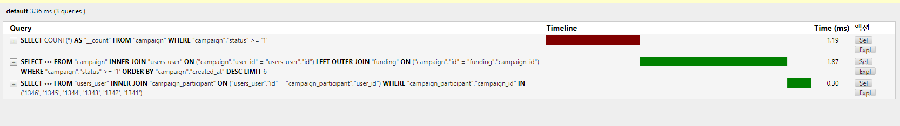

# 쿼리 최적화

## django-debug-toolbar

django-debug-toolbar
https://django-debug-toolbar.readthedocs.io/en/latest/

## Install

```bash
$ python -m pip install django-debug-toolbar
```

1. settings.py

```python
INSTALLED_APPS = [
# ...
"django.contrib.staticfiles",
# ...
]

STATIC_URL = "static/"

TEMPLATES = [
{
"BACKEND": "django.template.backends.django.DjangoTemplates",
"APP_DIRS": True,
# ...
}
]

INSTALLED_APPS = [
# ...
"debug_toolbar",
# ...
]

INTERNAL_IPS = [
    # ...
    "127.0.0.1",
    # ...
]
```

2. urls.py

루트폴더의 URLconf에 추가

```python
from django.urls import include, path

urlpatterns = [
    # ...
    path("__debug__/", include("debug_toolbar.urls")),
]
```

---

## Optimizing



serializer를 디테일 view와 리스트 view를 공유해서 사용중이었기에 쓸데없는 데이터들을 너무 많이 가져오고 있었다.

```python
class CampaignListSerializer(serializers.ModelSerializer):
    """
    작성자 : 최준영
    내용 : 캠페인 리스트 시리얼라이저 입니다.
    최초 작성일 : 2023.06.06
    업데이트 일자 : 2023.06.30
    """

    class Meta:
        model = Campaign
        fields = (
            "id",
            "user",
            "title",
            "members",
            "image",
            "fundings",
            "campaign_start_date",
            "campaign_end_date",
            "participant_count",
        )

    user = serializers.SerializerMethodField()
    fundings = FundingSerializer()
    participant_count = serializers.SerializerMethodField()

    def get_user(self, obj):
        return obj.user.username

    def get_participant_count(self, obj):
        return obj.participant.count()
```

필요한 데이터만 가져와 직렬화할 수 있도록 따로 serializer를 만든 뒤 확인해보니



아직도 비슷한 쿼리 18개와 5개의 중복쿼리를 갖고오는 N+1문제가 발생하고 있었다.

캠페인을 탐색 시 마다 user데이터를 계속 중복해서 User테이블을 조회해 비효율적인 쿼리탐색이 일어난 것.

Django의 쿼리조회가 Lazy Loading이 기본값이기에 Eager Loading으로 만들기 위해 OneToOne이나 캠페인에 대해 FK 관계인 User, fundings는 `select_related`로, ManyToMany관계인 participant는 `prefetch_related`로 연결해줬다.

```python
        # queryset = Campaign.objects.all()
        queryset = (
            Campaign.objects.select_related("user")
            .select_related("fundings")
            .prefetch_related("participant")
        )
```



유사쿼리와 중복쿼리가 모두 사라졌고, 속도 또한 개선되었다.
