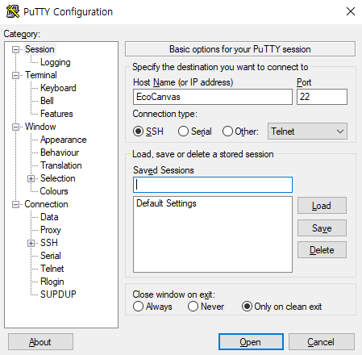
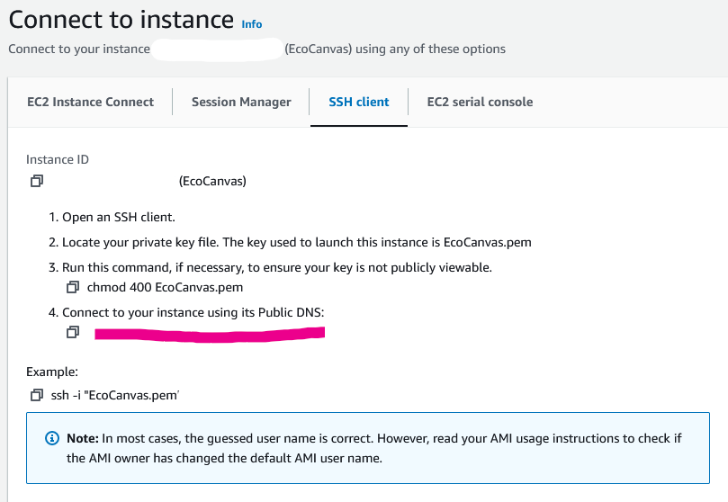
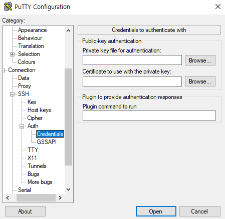
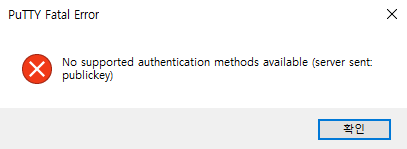
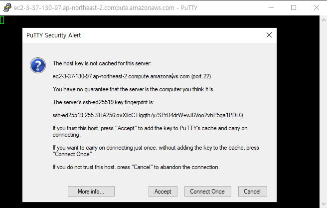

# PuTTY로 EC2 인스턴스에 SSH 연결해보기

인스턴스 생성 시에 Private key는 `.pem`으로 받아 PuTTY로 `.ppk` 파일로 변환할 예정이다.

AWS에 공식으로 지원하는 문서도 있어 편하게 변환할 수 있었다.

- [PuTTY를 사용하여 Windows에서 Linux 인스턴스에 연결](https://docs.aws.amazon.com/ko_kr/AWSEC2/latest/UserGuide/putty.html)
- [Windows와 Linux에서 .pem 파일을 .ppk로 변환하거나 .ppk를 .pem으로 변환하려면 어떻게 해야 하나요?](https://repost.aws/ko/knowledge-center/ec2-ppk-pem-conversion)

## PuTTYgen을 사용하여 프라이빗 키 변환

> PuTTY는 SSH 키의 PEM 형식을 기본적으로 지원하지 않습니다. PuTTY는 PuTTY에 필요한 PPK 형식으로 PEM 키를 변환하는 PuTTYgen이라는 도구를 제공합니다. PuTTY를 사용하여 인스턴스에 연결하려면 프라이빗 키(.pem 파일)를 이 형식(.ppk 파일)으로 변환해야 합니다.

### 프라이빗 .pem 키를 .ppk로 변환

1. Type of key to generate(생성할 키 유형)에서 RSA를 선택합니다. PuTTYgen 버전에 이 옵션이 포함되어 있지 않으면 SSH-2 RSA를 선택합니다.
   PuTTYgen의 RSA 키입니다.

2. 로드(Load)를 선택합니다. 기본적으로 PuTTYgen에는 확장명이 .ppk인 파일만 표시됩니다. .pem 파일을 찾으려면 모든 유형의 파일을 표시하는 옵션을 선택합니다.
   모든 파일 유형을 선택합니다.

3. 인스턴스를 시작할 때 지정한 키 페어에 대한 .pem 파일을 선택한 다음 열기를 선택합니다. PuTTYgen에 .pem 파일을 성공적으로 가져왔다는 알림이 표시됩니다. 확인을 선택합니다.

4. PuTTY에서 사용할 수 있는 형식으로 키를 저장하려면 [프라이빗 키 저장(Save private key)]을 선택합니다. PuTTYgen에서 암호 없이 키 저장에 대한 경고가 표시됩니다. 예를 선택합니다.

> 참고  
> 프라이빗 키의 암호는 추가 보호 계층입니다. 프라이빗 키가 노출되더라도 암호 없이 사용할 수 없습니다. 암호문 사용의 단점은 인스턴스에 로그온하거나 인스턴스에 파일을 복사하기 위해 사용자가 개입해야 하기 때문에 자동화를 어렵게 만든다는 것입니다.

5. 키 페어에 사용한 것과 동일한 키 이름을 지정하고(예: key-pair-name) [저장(Save)]을 선택합니다. PuTTY가 자동으로 .ppk 파일 확장자를 추가합니다.

이제 개인 키가 PuTTY에 사용하기에 올바른 형식으로 되어 있으므로 PuTTY의 SSH 클라이언트를 사용하여 인스턴스에 연결할 수 있습니다.

Are you sure you want to save this key without a passphrase to protect it?  
위 문구는 Yes를 눌러주면 된다

 

## PuTTY를 사용하여 인스턴스에 연결하려면

1.  Category에서 Session을 선택하고

    - `Host Name`에서 다음 중 하나를 수행합니다.

      (퍼블릭 DNS) 인스턴스의 퍼블릭 DNS 이름을 사용하여 연결하려면 `instance-user-name@instance-public-dns-name`를 입력합니다.

      (IPv6) 또는 인스턴스에 IPv6 주소가 있는 경우 인스턴스의 IPv6 주소를 사용하여 연결하려면 `instance-user-name@instance-IPv6-address`를 입력합니다.

      인스턴스의 사용자 이름과 인스턴스의 퍼블릭 DNS 이름 또는 IPv6 주소를 가져오는 방법에 대한 자세한 내용은 인스턴스에 대한 정보 가져오기 섹션을 참조하세요.

    - Port(포트) 값이 22인지 확인합니다.

    - 연결 유형 아래에서 SSH를 선택합니다.

    - [IPv4와 IPv6의 차이점](https://www.juniper.net/kr/ko/research-topics/what-is-ipv4-vs-ipv6.html)

  
인스턴스를 우클릭한 후에 Connect를 눌러 SSH client항목에 Example:의 `ssh -i "~~~.pem"`뒷부분을 그냥 쳐주면 된다.  
이 부분에서 공식문서의 `instance-user-name`이 ubuntu라는걸 몰라서 헤맸었다.

2.  (선택 사항) 세션의 활성 상태를 유지하기 위해 일정 간격으로 'keepalive' 데이터를 자동 전송하도록 PuTTY를 구성할 수 있습니다. 이는 세션 비활성으로 인한 인스턴스 연결 해제를 방지하는 데 유용한 기능입니다. 범주 창에서 연결을 선택한 다음, keepalive 간 초(Seconds between keepalives) 필드에 필요한 간격을 입력합니다. 예를 들어 비활성 상태가 되고 10분 후에 세션 연결이 해제되는 경우, 180을 입력하여 3분마다 keepalive 데이터를 전송하도록 PuTTY를 구성합니다.

3.  Category - Connection - SSH - Auth - Credentials로 갑니다.
    

    인증을 위한 개인 키 파일 옆에서 찾아보기를 선택합니다.

    키 페어에 대해 생성한 .ppk 파일을 선택한 다음 열기를 선택합니다.

    (선택 사항) 이 세션을 나중에 다시 시작하려는 경우 세션 정보를 나중에 사용할 수 있게 저장할 수 있습니다. 범주에서 세션을 선택하고 저장된 세션(Saved Sessions)에 세션 이름을 입력한 다음 저장을 선택합니다.

    [Open]을 선택합니다.

자격증명을 선택 안할 시 다음과 같은 에러가 뜬다.

여기선 Accept를 눌러주자.

4.  이 인스턴스에 처음 연결한 경우 PuTTY에서 연결하려는 호스트를 신뢰할 수 있는지 묻는 보안 알림 대화 상자가 표시됩니다.

    (선택 사항) 보안 알림 대화 상자의 지문이 앞의 (선택 사항) 인스턴스 지문 가져오기에서 얻은 지문과 일치하는지 확인합니다. 이들 지문이 일치하지 않으면 누군가가 "메시지 가로채기(man-in-the-middle)" 공격을 시도하고 있는 것일 수 있습니다. 이들 지문이 일치하면 다음 단계를 계속 진행합니다.

    수락을 선택합니다. 창이 열리고 인스턴스에 연결됩니다.

> 참고  
> 개인 키를 PuTTY 형식으로 변환할 때 암호문을 지정한 경우 인스턴스에 로그인할 때 암호문을 제공해야 합니다.
