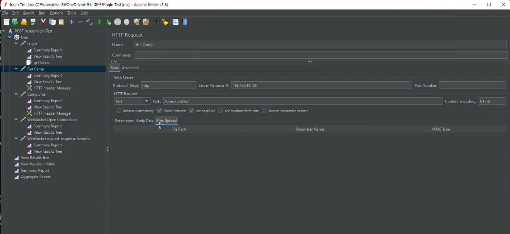

# 서버 부하테스트

VMWare Workstation Player
Ubuntu
Java 8
Jmeter

VMWare에 우분투 설치
서버용으로 깔면 GUI가 없을거임

로컬에서 안하고 가상환경을 구축하는 이유 = 서빙되는 데이터를 보기 위해
라우팅서버만들어서 할수도 있음

sudo passwd root

sudo apt-get install docker.io -y
sudo apt-get install docker-compose

vi docker-compose.yml
로컬서버설정txt

mkdir nginx

vi nginx/nginx.conf
로컬서버nginx.txt
방향키 자체가 입력모드에서 입력값이라서 조심해야함

docker-compose pull

docker-compose up --force-recreate --build -d

docker ps

apt install net-tools
ifconfig(in window ipconfig)

ens33이 우리 서버의 아이피 주소
192.168.95.128

window cmd 켜서 ping 192.168.95.128 치면 핑 확인가능
192.168.95.128/admin/도 접속은 불가능한상태

sudo docker exec -it 1 /bin/bash

env파일 설정후

docker-compose restart

데이터클럭이 밀리고있다
VMware의 사양을 aws 사용하는 티어의 사양으로 맞춰줘야함

Add sampler HTTP Request
HTTP Header Manager
