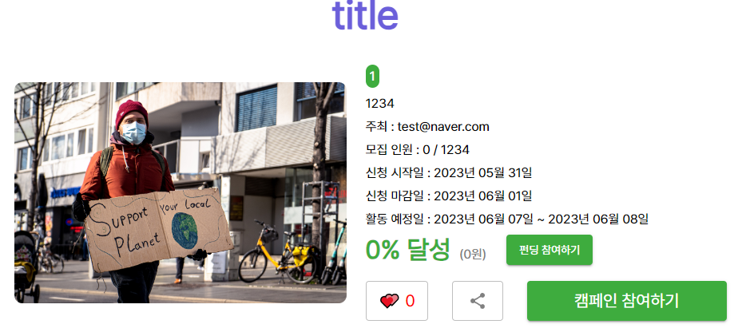
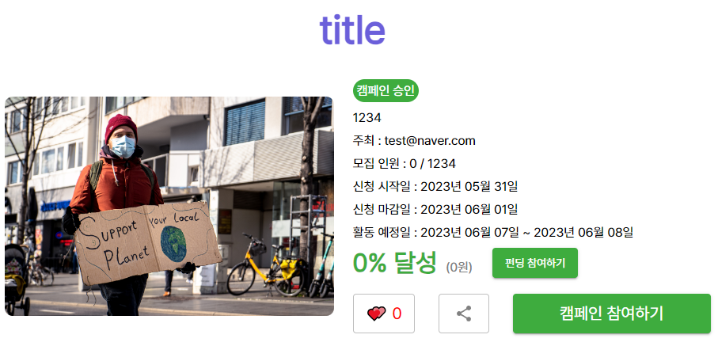

# ChoiceField serializing

## Problem

```python
class Campaign(BaseModel):
    class Meta:
        db_table = "campaign"

    STATUS_CHOICES = (
        (0, "미승인"),
        (1, "캠페인 승인"),
        ...
    )

    # 중략...

    status = models.PositiveSmallIntegerField("진행 상태", choices=STATUS_CHOICES, default=0)

```

```python
class CampaignSerializer(BaseSerializer):
    class Meta:
        model = Campaign
        fields = (
            # 중략...
            "status",
        )

    user = serializers.SerializerMethodField()
    fundings = FundingSerializer()
    campaign_start_date = serializers.SerializerMethodField()
    campaign_end_date = serializers.SerializerMethodField()
    activity_start_date = serializers.SerializerMethodField()
    activity_end_date = serializers.SerializerMethodField()
```

캠페인의 `status` 필드를 PositiveSmallIntegerField로 주고 choice 필드로 주어 캠페인을 상태코드로서 관리를 하고싶었다.

문제는 프론트에서 구현하니 뒤에있는 string값이 아닌 integer값을 프론트에서 보여주고 있었다.



fields에만 넣어주니 이렇게 뜨는게 당연한 것 같기도하다.  
`serializers.SerializerMethodField()`를 활용해야할 것 같다는 감은 오지만 잘 모르겠다.

---

## get_FOO_display()

[관련 공식문서 - Extra instance methods](https://docs.djangoproject.com/en/4.2/ref/models/instances/#django.db.models.Model.get_FOO_display)

```python
from django.db import models

class Person(models.Model):
    SHIRT_SIZES = [
        ("S", "Small"),
        ("M", "Medium"),
        ("L", "Large"),
    ]
    name = models.CharField(max_length=60)
    shirt_size = models.CharField(max_length=2, choices=SHIRT_SIZES)

p = Person(name="Fred Flintstone", shirt_size="L")
p.save()
p.shirt_size  # 'L' 출력
p.get_shirt_size_display()  # 'Large' 출력

```

선택 항목(choices)이 설정된 각 필드에 대해, 객체에는 get_FOO_display() 메소드가 있다. 여기서 FOO는 필드의 이름이며, 이 메소드를 통해 뒤의 string값을 serializing 할 수 있었다.

> null=True로 설정되지 않은 각 DateField와 DateTimeField에 대해, 객체에는 get_next_by_FOO()와 get_previous_by_FOO() 메서드가 있습니다. 여기서 FOO는 필드의 이름입니다. 이 메서드는 날짜 필드를 기준으로 다음과 이전 객체를 반환하며, 적절한 경우 DoesNotExist 예외를 발생시킵니다. 이 두 메서드는 모델의 기본 매니저를 사용하여 쿼리를 수행합니다. 사용자 정의 매니저에서 사용된 필터링을 에뮬레이트하거나 일회성 사용자 정의 필터링을 수행해야 하는 경우, 이 두 메서드는 선택적 키워드 인수를 받을 수도 있습니다. 이 인수는 Field lookups에서 설명하는 형식으로 제공해야 합니다. 동일한 날짜 값을 가진 경우, 이러한 메서드는 주 키(primary key)를 결정 요소로 사용합니다. 이로 인해 누락된 레코드가 없거나 중복된 레코드가 없음이 보장됩니다. 이러한 메서드는 저장되지 않은 객체에는 사용할 수 없다는 것에 유의하십시오. 일반적으로 get_FOO_display(), get_next_by_FOO(), get_previous_by_FOO()를 재정의하거나 상속하는 것이 예상대로 작동해야 합니다. 그러나 이러한 메서드는 메타클래스에 의해 추가되므로 모든 가능한 상속 구조를 고려하는 것은 현실적으로 어렵습니다. 더 복잡한 경우 필요한 메서드를 설정하기 위해 Field.contribute_to_class()를 재정의해야 합니다.

---

## Solving

```python
    status = serializers.SerializerMethodField()

    def get_status(self, obj):
        return obj.get_status_display()
```

serializer에 위처럼 get\_필드명\_display()를 `SerializerMethodField`를 사용해서 추가해주니



잘 떠주는 모습!
