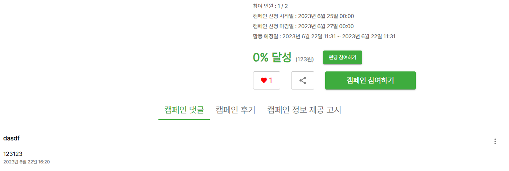

# UTC / Local

[DateFormat2](https://nueeng.github.io/FrontEnd/JavaScript/2023-06-18-js-dateFormat2/?category=all#blog)에서 Serializer를 사용해 프론트에서 처리없이 보여주니 DB에 찍힌 UTC시간을 그대로 찍어주고 있었다.

이걸 한국 로컬타임으로 프론트에서 보여주고 싶은 상황.

DB에는 UTC를 유지시키고 싶었고고, 프론트에선 로컬타임으로 보여주기 위해 Serializer에서 이 코드를 제거했다.

```python
    # serializers.py

    campaign_start_date = serializers.SerializerMethodField()
    campaign_end_date = serializers.SerializerMethodField()

    def get_campaign_start_date(self, obj):
        return obj.campaign_start_date.strftime("%Y년 %m월 %d일 %R")

    def get_campaign_end_date(self, obj):
        return obj.campaign_end_date.strftime("%Y년 %m월 %d일 %R")
```

이후 프론트에서 찍히는 데이터 시간을 보니 한국 로컬타임으로 그냥 잘 보내주고 있었다. 굳이 백엔드에서 SerializerMethodField를 사용할 이유가 없었다.

```js
// 시간 변환
function convertDateTime(datetimeString) {
  const datetime = new Date(datetimeString);
  const year = datetime.getFullYear();
  const month = datetime.getMonth() + 1;
  const date = datetime.getDate();
  const hour = datetime.getHours();
  const minutes = datetime.getMinutes();

  const koreanDatetime = `${year}년 ${month}월 ${date}일 ${hour
    .toString()
    .padStart(2, "0")}:${minutes.toString().padStart(2, "0")}`;

  return koreanDatetime;
}
```

지난번에 봤던 `Date()`메소드들과 `padStart()`를 사용하여 프론트에서 시간변환을 구현하는데 성공했다.


