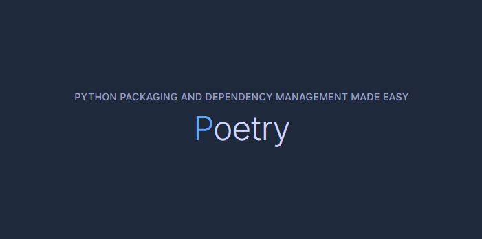

# Poetry



<br/>

## Introduction

[Poetry](https://python-poetry.org/docs/) Installation

> Poetry is a tool for dependency management and packaging in Python. It allows you to declare the libraries your project depends on and it will manage (install/update) them for you. Poetry offers a lockfile to ensure repeatable installs, and can build your project for distribution.

pip보다 의존성 관리를 더욱 용이하게 해주는 패키지 관리자  
<br/>

## Command

[Basic Usage](https://python-poetry.org/docs/basic-usage/)  
[Command](https://python-poetry.org/docs/cli/)

---

### Django 설치 기준

- `pythton -m venv venv`, `source venv/scripts/activate`

  venv 설정

- `poetry init`

  project.toml 파일 생성

- or `poetry new project`

  poetry 프로젝트 시작

- `poetry env use python`

  poetry 쓰면서도 virtualenv 사용하기

- `poetry install`

  pip의 `pip install -r requirements.txt`와 같음

- `poetry add django` (제거할 때는 remove)

  pip install django가 poetry에선 add

- `poetry shell`

  source venv/scripts/activate가 poetry에선 shell (deactivate는 어떻게?)
  poetry env use python를 썼다면 source ~ 사용

- `django-admin startproject config .`

  Django 프로젝트 시작

- `poetry run django-admin.py startproject config .`

  `poetry new project`로 실행 시켰을 때 새로운 폴더 안만들도록

- `django-admin startapp users`

  Users App 생성

<br/>

### pip install 설치 기준

```bash
python -m venv venv
pip install poetry
poetry init
poetry env use python
poetry add django
poetry install
```

- `poetry show`  
  poetry 패키지 목록 확인

- `poetry env info`  
  poetry venv 경로 확인

- `poetry add 모듈 --dev`  
  --dev 가 붙은 것은 배포환경에선 깔리지 않음!  
  (ex. Faker같은 testcode 작성에 필요한 패키지는 배포에선 깔 필요 없으니.)

- `poetry install --no-dev`  
  --dev 빼고 설치

---

#### ramble

pip도 지속된 패치를 통해 꽤 좋아져서 굳이 poetry를 사용하지 않아도 좋은 경우도 많다고 한다. 실제로 사용해보니 pip에 비해 많은것들을 숙지하고 있어야 좋은 것 같다

패키지가 계속 설치되고 지워지는 프로젝트나 라이브러리끼리 의존성이 강한 AI가 포함된 프로젝트에서는 큰 강점이 있을 것 같다
