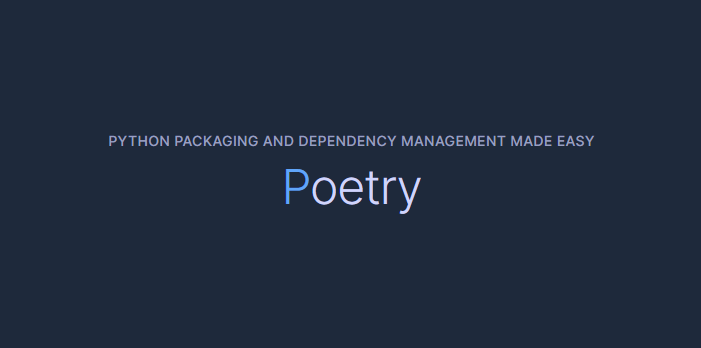

# Poetry

 

## Introduction  

[Poetry](https://python-poetry.org/docs/) Installation  

> Poetry is a tool for dependency management and packaging in Python. It allows you to declare the libraries your project depends on and it will manage (install/update) them for you. Poetry offers a lockfile to ensure repeatable installs, and can build your project for distribution.

pip보다 의존성 관리를 더욱 용이하게 해주는 패키지 관리자  
 

## Command

[Basic Usage](https://python-poetry.org/docs/basic-usage/)  
[Command](https://python-poetry.org/docs/cli/)

Django 설치 기준 예시

- `poetry init`  
  
  project.toml 파일 생성

- `poetry install`  
  
  ?

- `poetry add django`
  
  pip install django가 poetry에선 add

- `poetry shell`
  
  source venv/scripts/activate가 poetry에선 shell (deactivate는 어떻게?)

- `django-admin startproject config .`

  Django 프로젝트 시작

- `django-admin startapp users`
  
  Users App 생성